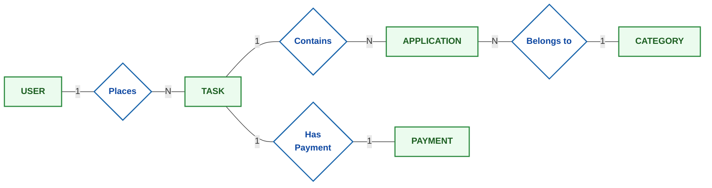
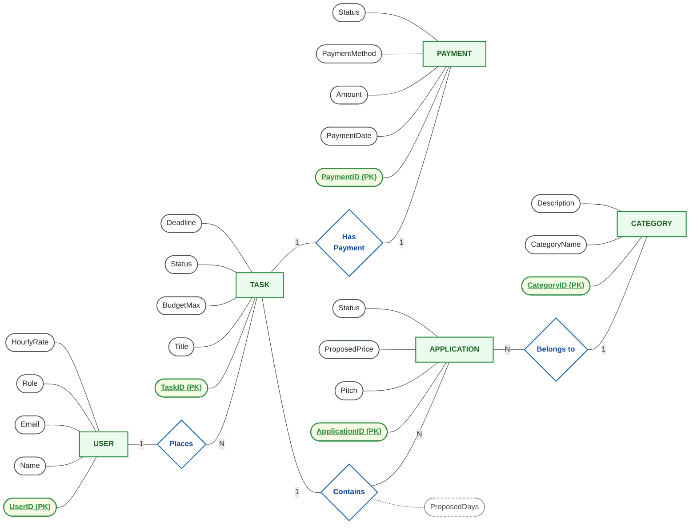
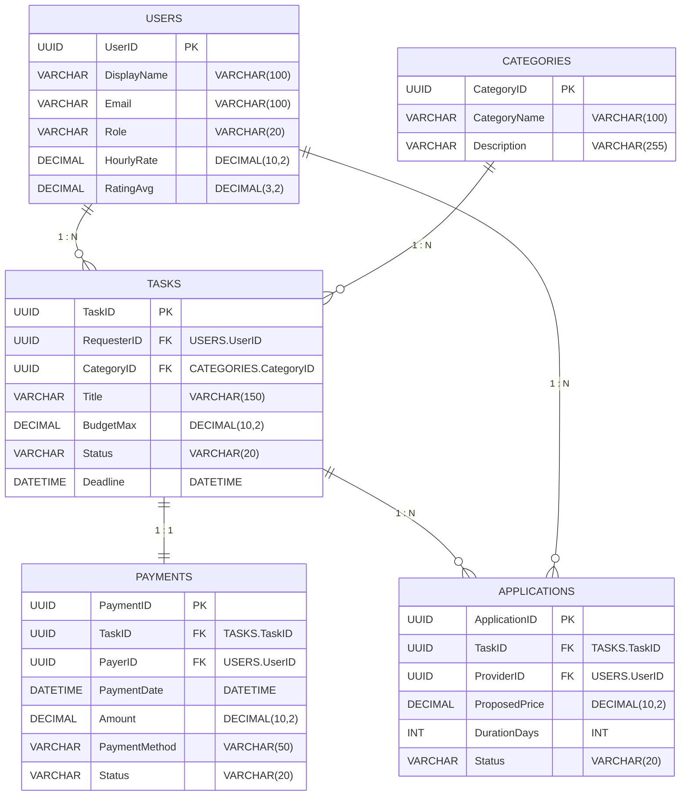

# Database Architecture: Conceptual, Logical & Physical ERD

This document replicates the 3-tier database architecture design with exact visual notations:
1. **CONCEPTUAL ERD (High-Level View)** — Chen's notation (Green entity boxes, Blue relationship diamonds, Cardinalities `1` & `N`).
2. **LOGICAL ERD (Detailed Logical View)** — Chen's notation with Entity Attributes in ovals, underlined Primary Keys, and relationship attributes.
3. **PHYSICAL ERD (Database-Level Implementation)** — Relational tables with Purple headers, `PK`, `FK`, SQL Data Types, and Crow's Foot relationships.

> 💡 **Excalidraw Visual Canvas**: A visual interactive `.excalidraw` version matching the reference image has been generated in [`.excalidraw`](file:///.excalidraw). Open it in VS Code to view or edit the canvas diagram directly!

---

## 1. CONCEPTUAL ERD (High-Level View)

In the Conceptual Model:
- **Entities** are represented by **Green rectangular boxes** (`USER`, `TASK`, `APPLICATION`, `CATEGORY`, `PAYMENT`).
- **Relationships** are represented by **Blue diamond shapes** (`Places`, `Contains`, `Belongs to`, `Has Payment`).
- **Cardinalities** (`1`, `N`) define the degree of association without implementation clutter.

---

## 2. LOGICAL ERD (Detailed Logical View)

In the Logical Model:
- **Attributes** are represented in **Ovals / Ellipses** linked to their respective entities.
- **Primary Keys** are highlighted with an underline (`<u>PK</u>`).
- **Relationship Attributes** (e.g., `ProposedDays`) are connected with dashed lines to the relationship diamond.
- Domain attributes, business constraints, and foreign key connections are fully defined.

---

## 3. PHYSICAL ERD (Database-Level Implementation)

In the Physical Model:
- Entities are represented as **Relational Tables** with **Purple Headers**.
- Columns denote Key constraints (`PK`, `FK`), Field Names, and **Data Types** (`UUID`, `VARCHAR`, `DECIMAL`, `INT`, `DATETIME`).
- Relationships use **Crow's Foot notation** to denote exact cardinality and foreign key relationships.

### Physical Schema Tables (Relational Layout)

| Table | Column | Key | Data Type | Nullable | Description |
|---|---|---|---|---|---|
| **USERS** | `UserID` | **PK** | `UUID` | No | Unique identifier for user |
| | `DisplayName` | | `VARCHAR(100)` | No | User full name |
| | `Email` | | `VARCHAR(100)` | No | Unique account email |
| | `Role` | | `VARCHAR(20)` | No | Role (requester, provider, admin) |
| | `HourlyRate` | | `DECIMAL(10,2)` | Yes | Base hourly service rate |
| | `RatingAvg` | | `DECIMAL(3,2)` | Yes | Average feedback score |
| **TASKS** | `TaskID` | **PK** | `UUID` | No | Unique identifier for task |
| | `RequesterID` | **FK** | `UUID` | No | References `USERS(UserID)` |
| | `CategoryID` | **FK** | `UUID` | Yes | References `CATEGORIES(CategoryID)` |
| | `Title` | | `VARCHAR(150)` | No | Task headline |
| | `BudgetMax` | | `DECIMAL(10,2)` | No | Budget ceiling |
| | `Status` | | `VARCHAR(20)` | No | `open`, `in_progress`, `completed` |
| | `Deadline` | | `DATETIME` | Yes | Target delivery date |
| **PAYMENTS** | `PaymentID` | **PK** | `UUID` | No | Unique payment record |
| | `TaskID` | **FK** | `UUID` | No | References `TASKS(TaskID)` |
| | `PayerID` | **FK** | `UUID` | No | References `USERS(UserID)` |
| | `PaymentDate` | | `DATETIME` | No | Timestamp of transaction |
| | `Amount` | | `DECIMAL(10,2)` | No | Escrow amount |
| | `PaymentMethod`| | `VARCHAR(50)` | No | Razorpay, Card, UPI |
| | `Status` | | `VARCHAR(20)` | No | `authorized`, `captured`, `refunded` |
| **APPLICATIONS** | `ApplicationID`| **PK** | `UUID` | No | Proposal identifier |
| | `TaskID` | **FK** | `UUID` | No | References `TASKS(TaskID)` |
| | `ProviderID` | **FK** | `UUID` | No | References `USERS(UserID)` |
| | `ProposedPrice`| | `DECIMAL(10,2)` | No | Quoted bid price |
| | `DurationDays` | | `INT` | No | Estimated turnaround |
| | `Status` | | `VARCHAR(20)` | No | `pending`, `accepted`, `rejected` |
| **CATEGORIES** | `CategoryID` | **PK** | `UUID` | No | Category identifier |
| | `CategoryName`| | `VARCHAR(100)` | No | Domain name (Web, Mobile, AI) |
| | `Description` | | `VARCHAR(255)` | Yes | Scope of category |

