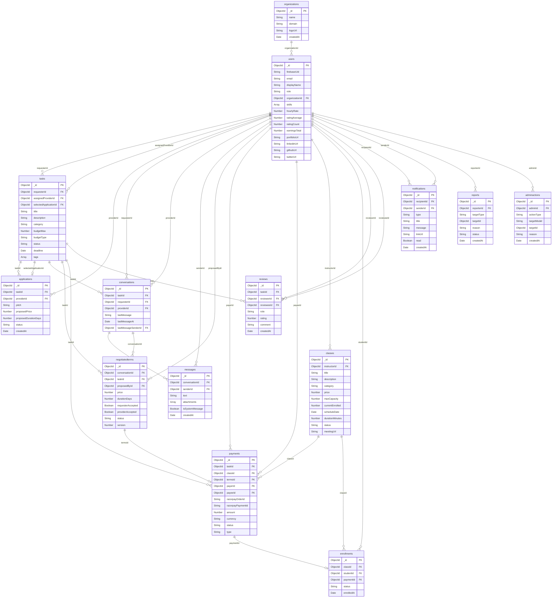

# Database Architecture: Conceptual, Logical & Physical ERD

This document covers the complete 3-tier data modeling architecture for the **Skill Exchange Platform**:
1. **Conceptual ERD** — High-level business concepts, domain entities, and core relationships.
2. **Logical ERD** — Normalized entities, logical attributes, business constraints, and foreign key relationships.
3. **Physical ERD** — MongoDB / Mongoose collection schemas with implementation data types (`ObjectId`, indexes, Razorpay integration).

---

## 1. Conceptual Data Model (Conceptual ERD)

The **Conceptual ERD** defines the business domain without database implementation details. It establishes **what** entities exist, business boundaries, and real-world interactions.

### Conceptual Mermaid Diagram

```mermaid
erDiagram
    ORGANIZATION ||--o{ USER : "associates"
    USER ||--o{ TASK : "requests / posts"
    USER ||--o{ APPLICATION : "proposes / bids"
    TASK ||--o{ APPLICATION : "receives"
    USER ||--o{ TASK : "is assigned to perform"

    USER ||--o{ CONVERSATION : "participates in"
    TASK ||--o{ CONVERSATION : "originates discussion"
    CONVERSATION ||--o{ MESSAGE : "contains"
    USER ||--o{ MESSAGE : "authors"

    CONVERSATION ||--o{ NEGOTIATED_TERMS : "governs"
    TASK ||--o{ NEGOTIATED_TERMS : "applies contract to"
    USER ||--o{ NEGOTIATED_TERMS : "proposes"

    USER ||--o{ PAYMENT : "funds escrow"
    USER ||--o{ PAYMENT : "receives payout"
    TASK ||--o{ PAYMENT : "secures escrow for"
    NEGOTIATED_TERMS ||--o| PAYMENT : "locks pricing & milestones"
    CLASS ||--o{ PAYMENT : "collects registration fee"

    USER ||--o{ CLASS : "hosts as instructor"
    CLASS ||--o{ ENROLLMENT : "admits"
    USER ||--o{ ENROLLMENT : "attends as student"
    PAYMENT ||--o| ENROLLMENT : "confirms ticket"

    TASK ||--o{ REVIEW : "evaluated by"
    USER ||--o{ REVIEW : "submits"
    USER ||--o{ REVIEW : "evaluated in"

    USER ||--o{ NOTIFICATION : "receives alerts"
    USER ||--o{ REPORT : "submits moderation flag"
    USER ||--o{ ADMIN_ACTION : "audited by staff"
```

### Business Rules (Conceptual Level)
- **Multi-Role User**: A `User` can post tasks as a *Requester*, perform tasks as a *Provider*, teach workshops as an *Instructor*, and attend classes as a *Student*.
- **Task Lifecycle**: A `Task` receives multiple `Application` bids. Once the requester selects an applicant, a `Conversation` facilitates real-time negotiation.
- **Contractual Agreement**: `NegotiatedTerms` locks in price and timeline before payment escrow.
- **Financial Escrow**: A `Payment` secures funds before work begins and disperses payout upon task acceptance or registers a seat in a `Class`.
- **Reputation Loop**: Completed tasks yield bilateral `Review` ratings affecting user trustworthiness.

---

## 2. Logical Data Model (Logical ERD)

The **Logical ERD** details business entities, candidate & foreign keys, domain attributes, constraints, and data types independent of physical DBMS storage.

### Logical Mermaid Diagram

```mermaid
erDiagram
    ORGANIZATION ||--o{ USER : "has members"
    USER ||--o{ TASK : "creates (requester_id)"
    USER ||--o{ TASK : "works on (assigned_provider_id)"
    USER ||--o{ APPLICATION : "submits (provider_id)"
    TASK ||--o{ APPLICATION : "receives proposals (task_id)"
    TASK ||--o| APPLICATION : "awards to (selected_application_id)"

    USER ||--o{ CONVERSATION : "requester participant"
    USER ||--o{ CONVERSATION : "provider participant"
    TASK ||--o{ CONVERSATION : "scoped to task (task_id)"
    CONVERSATION ||--o{ MESSAGE : "includes (conversation_id)"
    USER ||--o{ MESSAGE : "sent by (sender_id)"

    CONVERSATION ||--o{ NEGOTIATED_TERMS : "negotiated in (conversation_id)"
    TASK ||--o{ NEGOTIATED_TERMS : "contracts for (task_id)"
    USER ||--o{ NEGOTIATED_TERMS : "drafted by (proposed_by_id)"

    USER ||--o{ PAYMENT : "payer (payer_id)"
    USER ||--o{ PAYMENT : "payee (payee_id)"
    TASK ||--o{ PAYMENT : "task escrow (task_id)"
    NEGOTIATED_TERMS ||--o| PAYMENT : "settles terms (terms_id)"
    CLASS ||--o{ PAYMENT : "class fee (class_id)"

    USER ||--o{ CLASS : "teaches (instructor_id)"
    CLASS ||--o{ ENROLLMENT : "enrolls (class_id)"
    USER ||--o{ ENROLLMENT : "attends (student_id)"
    PAYMENT ||--o| ENROLLMENT : "purchased via (payment_id)"

    TASK ||--o{ REVIEW : "task reviewed (task_id)"
    USER ||--o{ REVIEW : "written by (reviewer_id)"
    USER ||--o{ REVIEW : "written for (reviewee_id)"

    USER ||--o{ NOTIFICATION : "recipient (recipient_id)"
    USER ||--o{ NOTIFICATION : "actor (sender_id)"

    USER ||--o{ REPORT : "reported by (reporter_id)"
    USER ||--o{ ADMIN_ACTION : "moderated by (admin_id)"

    ORGANIZATION {
        UUID organization_id PK
        String name
        String domain UK
        String logo_url
        Timestamp created_at
    }

    USER {
        UUID user_id PK
        String auth_provider_id UK
        String email UK
        String display_name
        Enum role
        UUID organization_id FK
        String_List skills
        Decimal hourly_rate
        Decimal rating_average
        Integer rating_count
        Decimal total_earnings
        String portfolio_url
        String linkedin_url
        String github_url
        String twitter_url
        Timestamp created_at
    }

    TASK {
        UUID task_id PK
        UUID requester_id FK
        UUID assigned_provider_id FK
        UUID selected_application_id FK
        String title
        Text description
        String category
        Decimal budget_max
        Enum budget_type
        Enum status
        Timestamp deadline
        String_List tags
        Timestamp created_at
    }

    APPLICATION {
        UUID application_id PK
        UUID task_id FK
        UUID provider_id FK
        Text pitch
        Decimal proposed_price
        Integer proposed_duration_days
        Enum status
        Timestamp created_at
    }

    CONVERSATION {
        UUID conversation_id PK
        UUID task_id FK
        UUID requester_id FK
        UUID provider_id FK
        Text last_message_preview
        Timestamp last_message_at
        UUID last_message_sender_id FK
    }

    MESSAGE {
        UUID message_id PK
        UUID conversation_id FK
        UUID sender_id FK
        Text message_body
        Attachment_List attachments
        Boolean is_system_event
        Timestamp sent_at
    }

    NEGOTIATED_TERMS {
        UUID terms_id PK
        UUID conversation_id FK
        UUID task_id FK
        UUID proposed_by_id FK
        Decimal agreed_price
        Integer agreed_duration_days
        Boolean requester_accepted
        Boolean provider_accepted
        Enum status
        Integer version_number
        Timestamp updated_at
    }

    PAYMENT {
        UUID payment_id PK
        UUID task_id FK
        UUID class_id FK
        UUID terms_id FK
        UUID payer_id FK
        UUID payee_id FK
        String gateway_order_id UK
        String gateway_payment_id UK
        Decimal amount
        String currency
        Enum payment_status
        Enum payment_type
        Timestamp processed_at
    }

    CLASS {
        UUID class_id PK
        UUID instructor_id FK
        String title
        Text description
        String category
        Decimal price
        Integer max_capacity
        Integer current_enrolled
        Timestamp schedule_date
        Integer duration_minutes
        Enum status
        String meeting_url
        Timestamp created_at
    }

    ENROLLMENT {
        UUID enrollment_id PK
        UUID class_id FK
        UUID student_id FK
        UUID payment_id FK
        Enum enrollment_status
        Timestamp enrolled_at
    }

    REVIEW {
        UUID review_id PK
        UUID task_id FK
        UUID reviewer_id FK
        UUID reviewee_id FK
        Enum reviewer_role
        Integer rating_score
        Text feedback_comment
        Timestamp created_at
    }

    NOTIFICATION {
        UUID notification_id PK
        UUID recipient_id FK
        UUID sender_id FK
        Enum notification_type
        String title
        Text message
        String link_url
        Boolean is_read
        Timestamp created_at
    }

    REPORT {
        UUID report_id PK
        UUID reporter_id FK
        Enum target_type
        UUID target_entity_id
        Text violation_reason
        Enum moderation_status
        Timestamp submitted_at
    }

    ADMIN_ACTION {
        UUID action_id PK
        UUID admin_id FK
        Enum action_type
        String target_model
        UUID target_entity_id
        Text action_reason
        Timestamp executed_at
    }
```

---

## 3. Physical Data Model (Physical ERD - MongoDB/Mongoose)

The **Physical ERD** reflects actual MongoDB documents, BSON types (`ObjectId`), specific foreign key indexing, and collection naming conventions.


