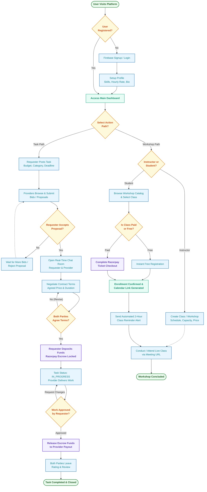

# System & Workflow Flowchart - Skill Exchange Platform

This document describes the complete operational and decision-making flowcharts for the **Skill Exchange Platform**.

> 💡 **Visual Excalidraw Canvas**: An interactive visual flowchart matching this design is available in [`flowchart.excalidraw`](file:///flowchart.excalidraw). Open it in VS Code to view, edit, or customize on canvas!

---

## 1. End-to-End System Workflow (Mermaid)

---

## 2. Core Functional Stages

### 1. Identity & Onboarding
- **Firebase Auth**: New visitors register via email or Google OAuth.
- **Profile Initialization**: Defines user role, portfolio links, skill tags, and base hourly rate.

### 2. Task Marketplace & Proposal Negotiation
- **Posting**: Requesters set task title, category, budget cap, and timeline.
- **Bidding**: Providers place applications with custom pitches and quotes.
- **Negotiation**: Once accepted, parties enter a private room where `NegotiatedTerms` are adjusted and bilaterally ratified.

### 3. Escrow Security & Milestone Delivery
- **Payment Escrow**: Powered by Razorpay. Funds remain securely locked in platform escrow until work is delivered.
- **Deliverable Review**: Requester inspects completed work. Can request revisions or approve for payout.

### 4. Live Workshops & Skill Classes
- **Class Creation**: Instructors schedule live group webinars with attendee caps.
- **Enrollment**: Students register with instant seat allocation (free or paid).
- **Automated Alerts**: Automated reminders dispatched 2 hours before session time with live meeting URLs.

